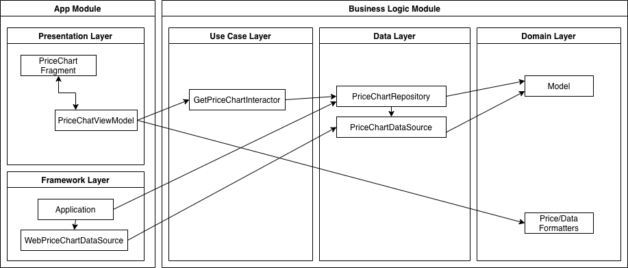

# Android Code Challenge

## The Task

The task was to built an Android application which fetches the bitcoin market price history and displays it in a chart.

## Architecture

We are using the Android Clean Architecture (following the Ray Wenderlich approach: https://www.raywenderlich.com/3595916-clean-architecture-tutorial-for-android-getting-started), which splits the application into 5 layers:

1. **Domain:** The Domain layer contains all the models and business logic/rules which bake the very core for our app.

2. **Data:** The data layer provides abstract definitions for accessing data sources like a database or web apis. Typically, the repository pattern is used, since it abstracts away the concrete implementation of data access.

3. **Use Cases / Interactors:** The Use Cases layer passes user actions, also known as use cases, to inner layers of the application.

4. **Presentation:** The presentation layer contains the user interface related code. Since it depends on the Android sdk, this layer is in the app module. So it can depend on the framework classes. Here we are using the MVVM pattern, where the ViewModel talks to the Interactors, since they are not supposed to directly access the business logic models.

5. **Framework:** Holds implementations of the interfaces defined in the data layer.

Layers 1, 2, 3 are independent from the Android SDK, in their very own `business-logic` module.
Layers 4 and 5 depend on the Android SDK, and are therefore located in the `app` module.
The following diagram gives a high level overview on how the components use each other.
Only outer layers can depend on inner layers (e.g. it is not allowed to have the domain module depend on the presentation layer.) This yields in a unidirectional data/dependency flow, which makes the whole architecture work.

## Dependency Injection

For dependency injection we are using Dagger. During production, the app is using the `AppComponent` dependency graph. During instrumented tests, the `TestAppComponent` is used, which is using a Fake implementation of the PriceChartDataSource.

## Testing

The `business-logic` module can be purely tested with unit tests, since it has no dependencies on the Android framework, it's especially quick and easy to test it.

The `app` module is tested by unit tests and instrumentation/espresso tests. During the instrumentation tests we click through the app and check for certain UI elements to match the expected values. Thanks to the use of dagger, we can easily swap implementations which rely on external APIs (like the `WebPriceChartDataSource`) with fake/mock implementations.

## Scaling

The project / architecture is set up to easily scale. The decoupled project structure allows us to add independent feature modules, which can then be integrated/glued together in the `app` module.
